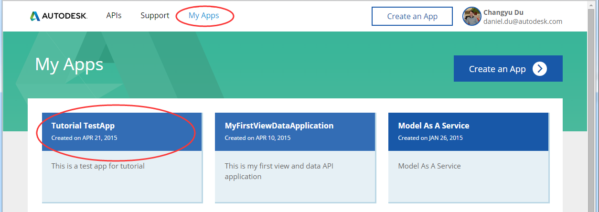
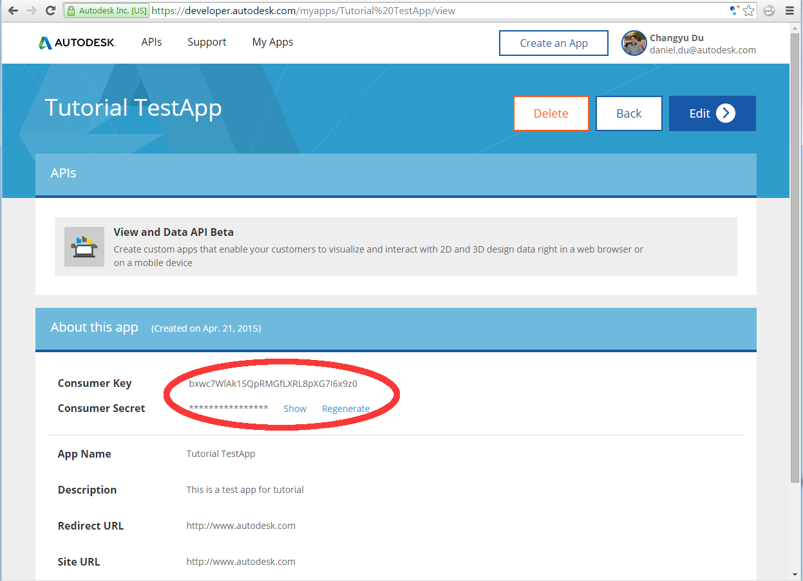

## Obtaining an API Key

All View & Data API applications accesses the service using an API key. The API key enables you to monitor your application's API usage, and ensures that Autodesk can contact you 
about your application if necessary. Because these keys are used to authenticate your access to the API, this also protects your data from being accessed without your permission.

To create your API key:

* Visit the [Autodesk Developers Page](https://developer.autodesk.com/api/view-and-data-api/) and sign in with your Autodesk Account, or click the Sign Up link to create an account for free 
if you don't already have one.

* Click the 'Create an App' link.

 

* Select the API you want to generate a key for. For this tutorial, select the 'View and Data API'.

 

* Complete the form and submit your request by pushing the 'Create App' button. Your application will appear in your application list. (Note: The 'Redirect URL' field is a required field, 
but you don't have to provide a real URL if you don't have one - just add something like 'http://www.mysite.com').

 

* Click on the newly created App to access your Consumer Key and Secret. You can review your App and API keys whenever you like by clicking on the 'My Apps' link after signing in.

 

By default, a key can be used on any site / application. However, we strongly recommend that you restrict the use of your key to domains that you administer, to prevent 
use on unauthorized sites. We also recommend you create a new App (API key) for every new application (rather than reusing the same key in multiple applications).

[Next](https://github.com/Developer-Autodesk/tutorial-getting.started-view.and.data/tree/dev-2.0#)